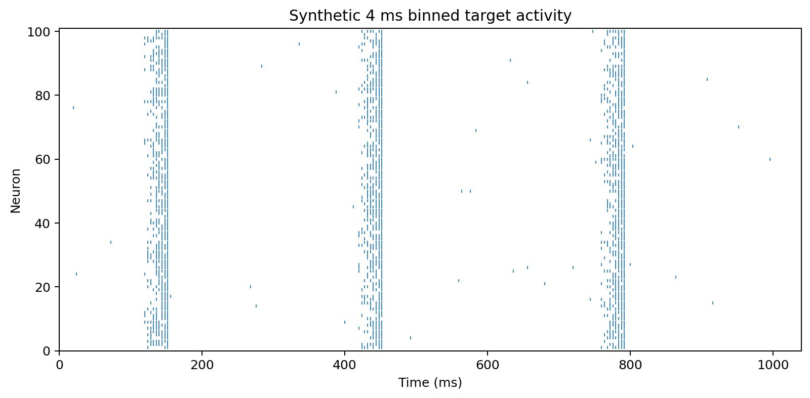
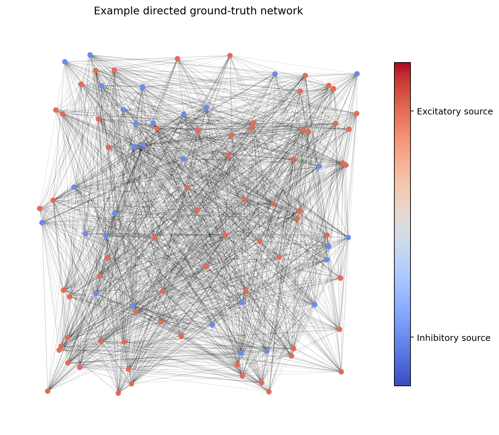
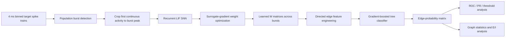

# Structural Connectivity Inference from Neural Activity with Spiking Neural Networks

[](https://github.com/benulisnyak/SNN_causal_inference/actions/workflows/ci.yml)
[](https://www.python.org/)
[](LICENSE)

An end-to-end machine-learning pipeline for inferring **directed structural connectivity** in spiking neuronal networks from observed population activity. The project combines differentiable spiking-neural-network (SNN) activity matching, edge-level feature engineering, gradient-boosted tree classification, and network-aware evaluation.

This repository grew out of an MSc computational-neuroscience research project. The public version is organized so that the modeling decisions, reusable code, example inputs, tests, experiments, and analysis workflows can be understood without first navigating the full thesis experiment directory.

<p align="center">
  
  
</p>

> **Data note:** the raster above is generated from the clearly labeled synthetic quickstart dataset. It is included for reproducibility and visualization only; it is not a reported thesis result.

## Problem

Functional relationships in neural activity do not map one-to-one onto physical synaptic connections. Correlated firing can arise from direct synapses, common inputs, indirect pathways, or population dynamics, while a true structural connection may be weakly expressed in a finite recording.

Instead of classifying edges directly from correlation, this project introduces a mechanistic intermediate representation:

1. train a recurrent LIF SNN to reproduce an observed burst by learning its recurrent weights;
2. repeat the fit over many burst samples;
3. summarize the learned weight distribution for each candidate directed edge; and
4. use a gradient-boosted classifier to estimate the probability that the structural edge exists.

## Pipeline



### Stage 1 — activity-matching SNN

The recurrent SNN uses leaky integrate-and-fire dynamics and learns internal synaptic weights from target spike activity. Burst extraction follows a population-level criterion aligned with the NEST simulation workflow: unique active neurons are counted in non-overlapping 50 ms windows, and burst-active windows must exceed the configured network-activity fraction. Each training sample is then cropped at 4 ms resolution from the first uninterrupted activity bin through the population-activity peak.

Hard spikes are retained in the forward simulation. A surrogate derivative is used during backpropagation so the recurrent weights can be optimized with gradient-based learning.

### Stage 2 — supervised structural edge inference

For every directed neuron pair, repeated learned weights are converted into edge-level features including:

- mean learned weight;
- minimum and maximum learned weight;
- standard deviation; and
- median learned weight.

A `GradientBoostingClassifier` then predicts the probability that the corresponding directed structural connection exists. Network instances are kept intact during grouped train/test splitting to avoid leakage between edge rows from the same simulated network.

### Evaluation

The research analysis covers both ranking performance and network reconstruction behavior:

- ROC AUC and precision-recall AUC;
- total, undirected, and direction-sensitive connectivity evaluation;
- threshold sweeps over TPR, FPR, precision, recall, F1, and related statistics;
- excitatory- versus inhibitory-source analysis;
- inferred connection density and clustering statistics; and
- aggregation across independent networks with confidence intervals.

## ML / data-science highlights

| Area | What this project demonstrates |
|---|---|
| **Deep learning** | Custom recurrent LIF SNN trained in PyTorch with surrogate gradients |
| **Feature engineering** | Converts repeated learned dynamical parameters into edge-level statistical features |
| **Supervised ML** | Gradient-boosted tree classification for directed edge probabilities |
| **Validation design** | Group-aware train/test splitting at the network level to prevent leakage |
| **Model evaluation** | ROC/PR analysis, threshold sweeps, confidence intervals, ablations and subgroup metrics |
| **Network science** | Directed adjacency reconstruction, density, clustering, and source-type analysis |
| **Scientific computing** | NumPy, pandas, SciPy, NetworkX, PyYAML, Matplotlib, PyTorch and scikit-learn |
| **Engineering** | Installable package, CLI, unit tests, linting, CI, deterministic example data and documented formats |

## Repository layout

```text
.
├── src/snn_connectivity/        # Reusable, test-covered Python package
│   ├── burst_detection.py       # NEST-style population burst detection
│   ├── features.py              # Directed edge feature engineering
│   ├── io.py                    # YAML and spike-matrix loaders
│   ├── metrics.py               # Binary ranking/classification metrics
│   ├── modeling.py              # GBT construction and grouped splitting
│   ├── plotting.py              # Lightweight example visualizations
│   └── cli.py                   # Command-line inspection utilities
│
├── experiments/                 # Complete model-training workflows
│   ├── train_activity_matching_snn.py
│   ├── train_edge_classifier.py
│   └── train_neuron_type_classifier.py
│
├── analysis/                    # Post-training evaluation and plotting
│   ├── evaluate_probability_thresholds.py
│   ├── plot_roc_pr_confidence_intervals.py
│   └── analyze_probability_matrices.py
│
├── networks/                    # Example ground-truth network YAML
├── fdata/                       # Public target-data placeholder + format note
├── examples/                    # Deterministic synthetic runnable example
├── results/figures/             # Small tracked README figures
├── tests/                       # Unit tests for reusable code
├── docs/                        # Methodology, data format, reproducibility
├── .github/workflows/ci.yml     # Automated lint/tests/smoke checks
├── pyproject.toml
└── requirements.txt
```

The directory split mirrors the ML workflow. `src/` exposes reusable components;
`experiments/` contains the full training pipelines used for the research; and
`analysis/` contains threshold evaluation, ROC/PR aggregation, and graph-level
diagnostics. This keeps the core scientific code easy to locate without mixing
long-running experiments with reusable library utilities.

## Quickstart

The quickstart does **not** require PyTorch or the full thesis output dataset.

```bash
# 1. Clone and enter the repository
git clone https://github.com/benulisnyak/SNN_causal_inference.git
cd SNN_causal_inference

# 2. Create an environment
python -m venv .venv
source .venv/bin/activate          # Windows: .venv\Scripts\activate

# 3. Install the lightweight package and developer tools
python -m pip install --upgrade pip
python -m pip install -e ".[dev]"

# 4. Inspect the example ground-truth network
snn-connectivity inspect-network networks/network_N100_p24_CC01_1.yaml

# 5. Inspect the synthetic 4 ms spike train and detect bursts
snn-connectivity inspect-spikes examples/synthetic_fdata_N100_demo.txt --expected-n 100

# 6. Recreate the README figures
snn-connectivity make-example-figures \
    --network networks/network_N100_p24_CC01_1.yaml \
    --spikes examples/synthetic_fdata_N100_demo.txt \
    --output-dir results/figures

# 7. Run tests
pytest
```

Equivalent convenience targets are available through `make demo`, `make figures`, `make test`, and `make lint`.

A lightweight Docker image is also provided for the inspection CLI:

```bash
docker build -t snn-connectivity .
docker run --rm snn-connectivity inspect-network networks/network_N100_p24_CC01_1.yaml
```

## Full research environment

The activity-matching stage requires PyTorch:

```bash
python -m pip install -e ".[training,dev]"
```

Target datasets for a full run are expected under statistics-specific folders such as:

```text
fdata/N100_p24_CC03/fdata_N100_p24_CC03_1.txt
```

A typical activity-matching run is then launched from the repository root with:

```bash
python experiments/train_activity_matching_snn.py N100_p24_CC03 --skip-trained-samples
```

The script detects burst samples, optimizes the recurrent connectivity for each burst, and writes learned connectivity matrices to `LIFoutput_files/`. The structural edge classifier is then run as the second modeling stage:

```bash
python experiments/train_edge_classifier.py
```

The default edge-classification run saves held-out `prob_matrix_*.npy` arrays, feature importance, split metadata, and per-network metrics under `prob_matrices/`. Post-training probability matrices can be evaluated with the scripts under `analysis/`, for example:

```bash
python analysis/evaluate_probability_thresholds.py
```

See [`experiments/README.md`](experiments/README.md) for the training workflows and [`analysis/README.md`](analysis/README.md) for post-training evaluation.

## Example input formats

### Ground-truth network

The included network YAML stores directed targets and signed outgoing weights:

```yaml
- id: 1
  pos: [0.483, 0.599]
  connectedTo: [2, 5, 8]
  weights: [1.0, 1.0, 1.0]
```

### Target activity

Binned target activity is represented as `[time bins, neurons]`:

```text
0, 0, 1, 0, ...
0, 1, 0, 0, ...
1, 0, 0, 1, ...
```

See [`docs/data_format.md`](docs/data_format.md) for complete conventions.

## Reproducibility and data leakage

Two choices are especially important for interpreting this project correctly:

**Network-level splitting.** Candidate edges from one network are not independent observations. Grouping train/test splits by network instance prevents the same network's dynamics from appearing on both sides of the evaluation.

**Research-code traceability.** The complete thesis-scale workflows are retained in `experiments/` and `analysis/`, but their organization, naming, comments, and entry points are cleaned up for review. The numerical procedures and experiment defaults remain aligned with the research implementation, while reusable operations are also exposed through the tested `src/` package.

Additional details are in [`docs/reproducibility.md`](docs/reproducibility.md).

## Testing and CI

Every push and pull request runs:

```text
ruff check src tests
compile experiments/ and analysis/ scripts
pytest
network YAML smoke test
synthetic spike-data / burst-detection smoke test
```

The CI workflow intentionally avoids installing PyTorch because the test suite validates the reusable data/ML utilities rather than re-running expensive thesis training jobs.

## Experiment code versus generated outputs

Full experiment outputs can be large, so learned matrices, probability matrices, threshold CSVs, and bulk training plots are excluded from Git. The repository tracks small example inputs and figures while documenting how larger outputs are regenerated.

No synthetic quickstart result is presented as experimental performance.

## Documentation

- [`docs/methodology.md`](docs/methodology.md) — model and inference pipeline
- [`docs/data_format.md`](docs/data_format.md) — YAML, fdata, learned-matrix and probability-matrix formats
- [`docs/reproducibility.md`](docs/reproducibility.md) — environment, leakage prevention and output policy
- [`experiments/README.md`](experiments/README.md) — model-training workflows
- [`analysis/README.md`](analysis/README.md) — evaluation and plotting workflows

## Author

**Benjamin A. Ulisnyak**  
MSc research in computational neuroscience / machine learning

## License

Released under the [MIT License](LICENSE).
